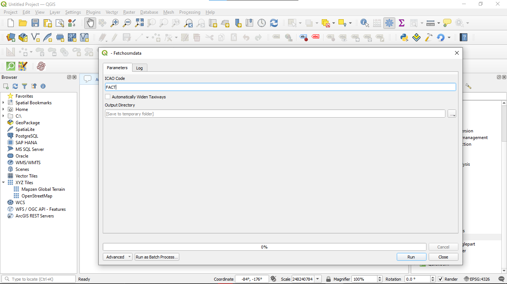
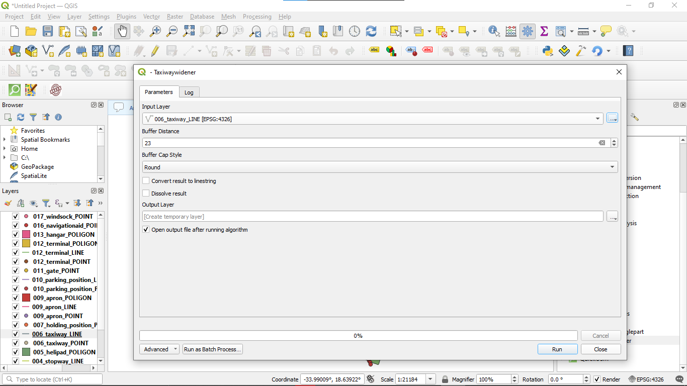
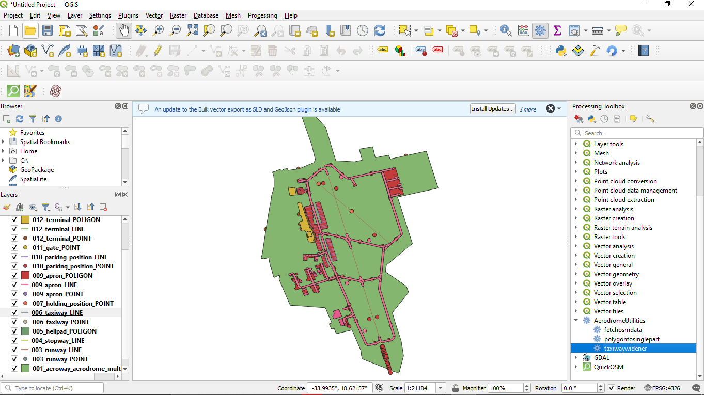

# AerodromeUtilities

May or May not crash your QGis!

AerodromeUtilities is a simple plugin helping in fetching OSM data for airports, widening taxiways and converting polygons to linestring. **PLEASE NOTE: This plugin is quite incomplete :) so except many bugs**

## Fetching Airport OSM Data

To fetch OSM Data, you can access it via the processing toolbox by settings cog icon in QGis toolbar or `Ctrl+Alt+T`. Next, you can set an ICAO Code and setting an output folder. I reccommend adding it to a folder like `{ICAO}/Step 1`. When you click "Run", different layers should be loaded and you should see them being generated on the map. At the end of the execution, you might see layers failing to generate like this:

This message is normal so it is safe to ignore. *I haven't yet found the cause of this.*

## Widening Taxiways / Runways
With the airport loaded, you can select the taxiwaywidener tool from the processing tool under AerodromeUtilities. When you select the tool, the following interface will pop up.

  
Options
- Input Layer: This is the input line layer you want to widen (eg taxiway/runway layer)
- Buffer distance: The distance you want to extend each side by(**not the taxiway/runway witdth but it divided by 2**)
- Convert Polygon to linestring: Whether to convert the resultant polygon back into a linestring for export to TS/GR 
- Dissolve Result: Smooths the end caps generated by the native buffer tool in QGis. *Highly reccommended because it reduces the risk of TS Not accepting it as a polygon*
- Output Layer - Saves the output layer to a file which is reccommended to prevent losing any layer

### Fixing the CRS
No CRS fix needed!

Then taxiways should show up as configured!
