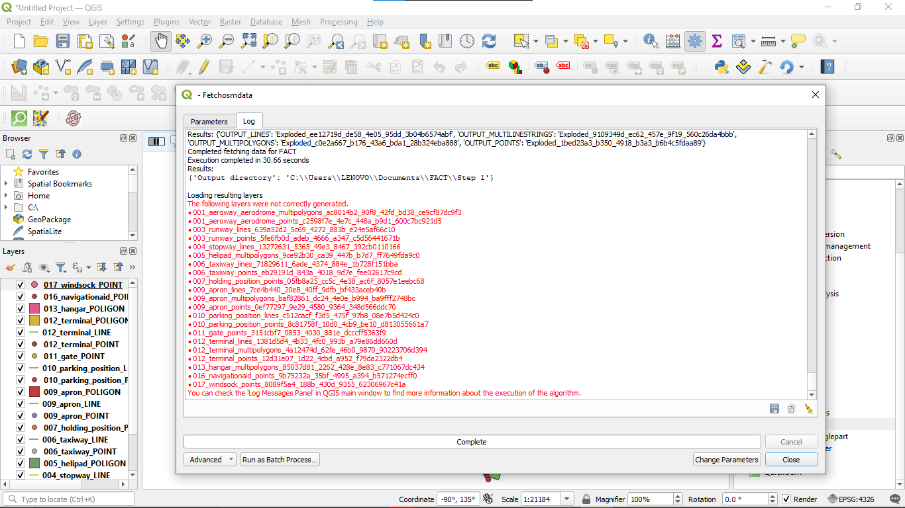

# AerodromeUtilities

AerodromeUtilities is a simple plugin helping in fetching OSM data for airports, widening taxiways and exporting the data to data file formats of the [EuroScope](euroscope.hu/wp/) plugins [TopSky](https://forum.vatsim-scandinavia.org/d/38-topsky-plugin-25-beta-10) and [GroundRadar](https://forum.vatsim-scandinavia.org/d/33-ground-radar-plugin-15) **PLEASE NOTE: This plugin is quite incomplete :) so except many bugs**

## Quickstart

### Installation
- Go to the QGIS Plugin Manager window and ensure both [QuickOSM](https://plugins.qgis.org/plugins/QuickOSM/) and the [plugin](https://plugins.qgis.org/plugins/widen-line-qgis-plugin/) are installed. **NOTE: The plugin requires QuickOSM to be installed in order for it to work**

### Fetching Airport OSM Data

To fetch OSM Data, you can access it via the processing toolbox by settings cog icon in QGis toolbar or `Ctrl+Alt+T`. 

Next, you can set an ICAO Code and setting an output folder. I reccommend adding it to a folder like `{ICAO}`. When you click "Run", different layers should be loaded and you should see them being generated on the map. At the end of the execution, you might see layers failing to generate like this:

This message is normal so it is safe to ignore. *I haven't yet found the cause of this.*

### Widening Taxiways / Runways
With the airport loaded, you can select the Widen Taxiways tool from the processing tool under AerodromeUtilities. When you select the tool, the following interface will pop up. When widening taxiways, you may change the Project CRS to `ESPG:3857` as that works best and gives the widener the scope of metres. The plugin should convert the lines CRS automatically but may not work 100% of the time so for that reason it's reccommended the project CRS be `ESPG:3857` for the purpose of widening taxiways but you can change the CRS as you wish later(`ESPG:4326` WGS 84 standard is reccommended).

  
Options
- Input Layer: This is the input line layer you want to widen (eg taxiway/runway layer)
- Buffer distance: The distance you want to extend each side by(**not the taxiway/runway witdth but it divided by 2**)
- Convert Polygon to linestring: Whether to convert the resultant polygon back into a linestring for export to TS/GR 
- Dissolve Result: Smooths the end caps generated by the native buffer tool in QGis. *Highly reccommended because it reduces the risk of TS Not accepting it as a polygon*
- Output Layer - Saves the output layer to a file which is reccommended to prevent losing any layers.

After this the taxiways may be further digitized in any using Google Satellite imagery etc, as OSM data is often not exact for your use case and prone to errors.

Then taxiways should show up as configured!

### Exportation
In order to export the layers, specify the ICAO code and specify the output directory. This should create 3 files in the output directory.

- TopSkyMaps.txt - *Maps for use with TopSky plugin*
- GroundRadar.txt - *Maps for use with GroundRadar plugin*
- Stands.txt - *Stand data for use with GroundRadar plugin*

More information on other algorithms in the [wiki](https://github.com/BrakingChanges/widen-line-qgis-plugin/wiki)

## Contribution
Contribution is always welcome, the current contribution process is as follows:
1. Fork the repo
2. Clone the repo
3. Checkout a branch from main
4. Make your changes
5. Push the changes
6. Make an issue with a supporting PR fixing that issues

